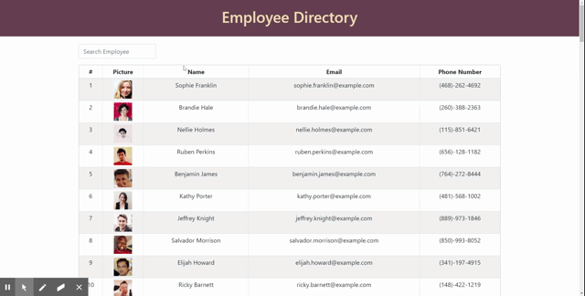

# React Employee Directory

This project was bootstrapped with [Create React App](https://github.com/facebook/create-react-app). This applicatin is an employee directory using data from an open-souce API [Random User Generator](https://https://randomuser.me/) to populate random data and then formed a directory. User can perform search and sort functionality to narrow down the list of the employee. This app allows a search by name and sort by employee's name or email address .

## User Story

- As a user, I want to be able to view my entire employee directory at once so that I have quick access to their information.

## Installation

### Steps required to run the application through **local server** in development mode:

- In the terminal, run **npm install** to have its dependecy packages installed. After all the neccesary tools are set, the app is ready to run the application in Node environment by typing **npm start**.
- Then after sucessfull connection, the browser will automatically directed to list to _localhost:3000_. \
  The page will reload if you make edits.\
  You will also see any lint errors in the console.

## Deployment

This application is deployed through GitHub Pages. Deployment instruction can be found in the [Create React App docs for deployment.](https://create-react-app.dev/docs/deployment/#github-pages). \
A gh-pages branch will be created in your GitHub project and the page will be published from that branch. \
Deployed Link: https://carolinayo.github.io/react-employeeDirectory/

## Preview

### Functionality

- This application allows user to sort in ascending and descending order from the column **Name** and **Email**.
- User can narrow down the list of employee by performing a **search** action by entering any letter of the **employee's name**. \
  

## MAINTAINER

This is an individual assignment maintained by Carolina Yoedhana.

- GitHub repo: https://github.com/CarolinaYo/react-emplyeeDirectory.git
- Deployed GitHub Page link: https://carolinayo.github.io/react-employeeDirectory/
